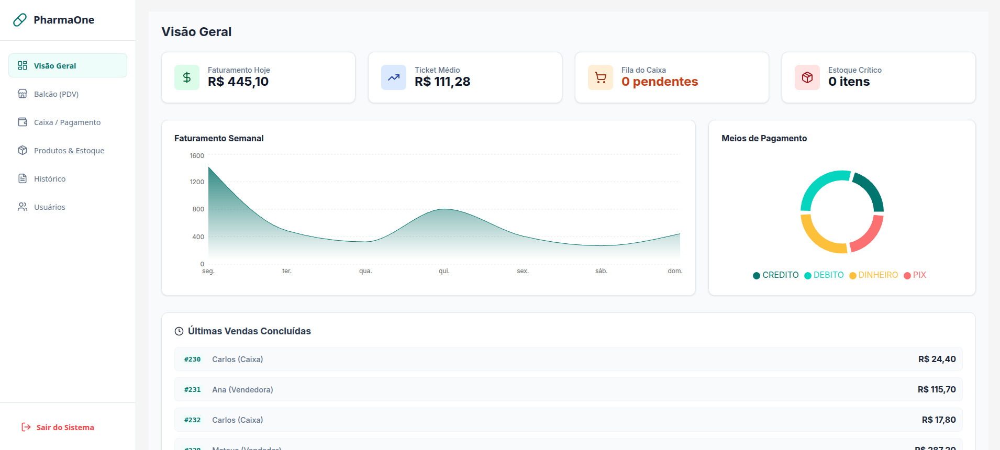

# 🏥 Smart Pharma - Sistema de Gestão Farmacêutica

[📘 Ver Documentação Online](https://apolo442.github.io/pharma-erp/)

ERP moderno e ágil desenvolvido para farmácias, com foco na eficiência do atendimento no balcão (PDV) e segurança no fechamento de caixa.

# 🚀 Funcionalidades Principais

## 🛒 Frente de Caixa (PDV)

Busca Híbrida: Pesquisa de produtos por Texto (Nome/ID) e Filtragem por Categorias simultaneamente através de uma barra de navegação horizontal.

Autenticação Ágil: Sistema de login rápido para vendedores via Código + PIN (sem necessidade de e-mail/senha complexa no balcão).

Carrinho Inteligente: Controle de estoque em tempo real durante a adição de itens e validação de limites.

Pré-Venda: Geração de pedidos com status PENDENTE que envia o valor total calculado para o caixa automaticamente.

## 💰 Módulo de Caixa

Fila de Atendimento: Visualização em tempo real de todas as pré-vendas geradas no balcão.

Finalização Financeira: Registro de formas de pagamento (Dinheiro, PIX, Débito, Crédito).

Baixa de Estoque: O estoque só é debitado efetivamente após a confirmação do pagamento usando Transactions do Prisma para garantir integridade.

## 👥 Gestão de Usuários

Controle de Acesso: Perfis diferenciados para Administrador e Farmacêuticos.

Segurança Híbrida: Senha forte para login administrativo e PIN de 4 dígitos para operações rápidas no PDV.

Inativação Inteligente: Sistema de ativo/inativo (Soft Delete) para preservar o histórico de vendas de funcionários antigos.

## 🛠️ Tecnologias Utilizadas

**Frontend/Backend:** Next.js 14 (App Router)

**Linguagem:** TypeScript

**Banco de Dados:** SQLite (Desenvolvimento)

**ORM:** Prisma

**Estilização:** CSS Modules (Layout) + Tailwind CSS (Componentes)

**Ícones:** Lucide React

## **Validação:** Zod

# ⚙️ Configuração e Instalação

## 1. Pré-requisitos

Certifique-se de ter o Node.js (v18+) e o NPM instalados.
##2. Instalação

```Bash
# Clone o repositório
git clone https://github.com/Apolo442/pharma-erp.git
# Entre na pasta
cd smart-pharma
# Instale as dependências
npm install
```

## 3. Configuração do Banco de Dados

Crie um arquivo .env na raiz do projeto e configure a URL do banco SQLite:

```Bash
DATABASE_URL="file:./dev.db"
```

Em seguida, execute as migrações e o script de povoamento (seed):

```Bash
# Sincroniza o banco de dados com o schema
npx prisma migrate dev --name init

# Popula o sistema com usuários e produtos de teste
npx prisma db seed
```

## 4. Executando o Projeto

```Bash
npm run dev
```

Acesse http://localhost:3000 no seu navegador.
Nota: Para acesso administrativo via e-mail, a senha padrão é 123456.

# 🛡️ Regras de Negócio Implementadas

**Venda Segura:** O sistema impede que o preço do produto seja alterado pelo frontend; a Server Action recalcula o total buscando os preços diretamente no banco de dados.

**Fluxo de Estoque:** O estoque é reservado visualmente no PDV, mas a baixa real só ocorre no momento do "OK" no Caixa.

**Integridade de Dados:** O cancelamento de uma pré-venda antes do pagamento não afeta o estoque (já que a baixa ainda não havia ocorrido).

---

Desenvolvido por Mateus.
